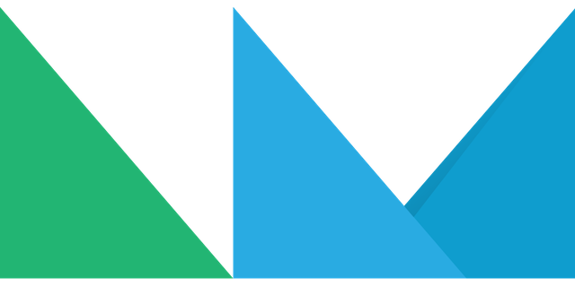
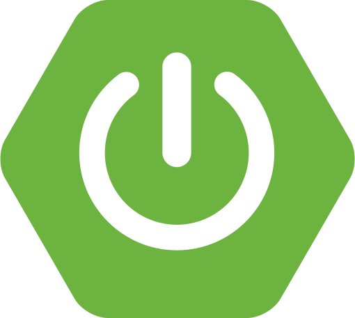
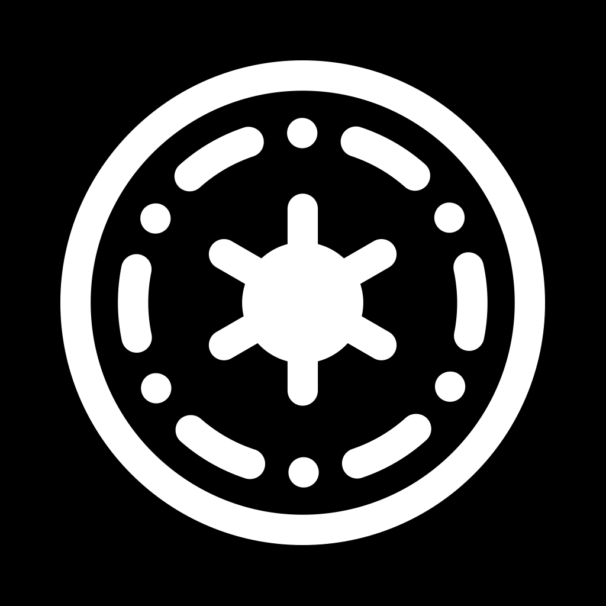
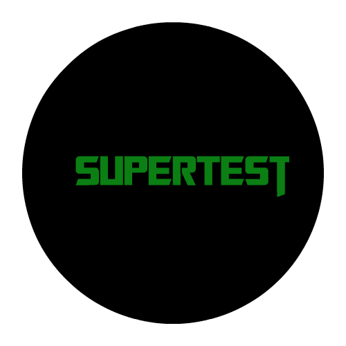
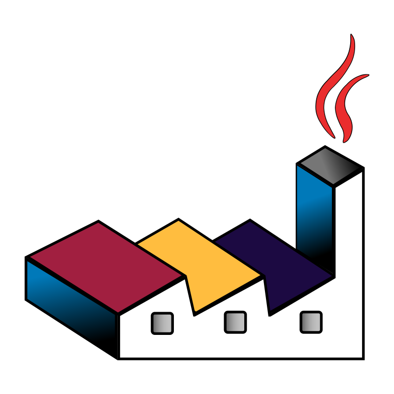

<!-- markdownlint-disable MD033 -->
<!-- BANNER GENERADO CON: https://leviarista.github.io/github-profile-header-generator/ -->

    🔭 Actualmente estoy trabajando en un <strong>⌨️ Proyecto creativo de simulador de guitarra 🎸</strong>
     
    🌱 Actualmente estoy aprendiendo <strong>➡️ Next.js & LangChain🦜</strong> 
     
    🤝 Estoy interesado en <strong>🧩 arquitectura de software y sistemas escalables 📖</strong>
     
    💬 Preguntame sobre <strong>⚛️ React, Next.js Node y/o Spring Boot 🍃</strong>
     
    📫 Puedes contactarme enviando un email a <strong>📨 <a href="mailto:enrique1010k@gmail.com">enrique1010k@gmail.com</a> 📨</strong>
     
    ⚡ Un dato curioso es que soy jugador de <strong>⚙️ Yu-Gi-Oh! Master Duel 🚅</strong>

<h1 align="center">Contacto</h1>

<table align="center" border="1">
  <tr>
    <td></td>
    <td></td>
    <td></td>
  </tr>
</table>

<h1 align="center">Tecnologías</h1>

<h2 align="center">Lenguajes de programación</h2>
<table align="center" border="1">
  <tr>
    <td></td>
    <td></td>
    <td></td>
    <td></td>
  </tr>
</table>

<h2 align="center">Desarrollo Frontend</h2>
<table align="center" border="1">
  <tr>
    <td></td>
    <td></td>
    <td> </td>
    <td></td>
  </tr>
</table>
<table align="center" border="1">
  <tr>
    <td></td>
    <td></td>
  </tr>
</table>

<h2 align="center">Desarrollo Backend</h2>
<table align="center" border="1">
  <tr>
    <td></td>
    <td></td>
    <td></td>
    <td></td>
  </tr>
</table>

<h2 align="center">Bases de datos</h2>
<table align="center" border="1">
  <tr>
    <td></td>    
    <td></td>
    <td></td>
  </tr>
</table>

<h2 align="center">Dependencias</h2>
<table align="center" border="1">
  <tr>
    <td></td>
    <td></td>
    <td></td>
    <td></td>
  </tr>
</table>
<table align="center" border="1">
  <tr>
    <td></td>
    <td></td>
    <td></td>
    <td></td>
  </tr>
</table>
<table align="center" border="1">
  <tr>
    <td></td>
    <td></td>
    <td></td>
    <td></td>
  </tr>
</table>
<table align="center" border="1">
  <tr>
    <td></td>
    <td></td>
    <td></td>
  </tr>
</table>
<table align="center" border="1">
  <tr>
    <td></td>
    <td></td>
    <td></td>
    <td></td>
    <td></td>
  </tr>
</table>

<h2 align="center">Herramientas de construcción y empaquetado</h2>
<table align="center" border="1">
  <tr>
    <td></td>
    <td></td>
    <td></td>
    <td></td>
  </tr>
</table>

<h2 align="center">Integraciones con servicios externos</h2>
<table align="center" border="1">
  <tr>
    <td></td>
    <td></td>
  </tr>
</table>

<h2 align="center">Plataformas como Servicio (PaaS)</h2>
<table align="center" border="1">
  <tr>
    <td></td>
    <td></td>
  </tr>
</table>
    <!--  -->

<h2 align="center">Pruebas</h2>
<table align="center" border="1">
  <tr>
    <td></td>
  </tr>
</table>
  <!--  -->

<h2 align="center">Software y herramientas</h2>
<table align="center" border="1">
  <tr>
    <td></td>
    <td></td>
    <td></td>
  </tr>
</table>

<table align="center" border="1">
  <tr>
    <td></td>
    <td></td>
    <td></td>
    <td></td>
    <td></td>
  </tr>
</table>

<table align="center" border="1">
  <tr>
    <td></td>
    <td></td>
    <td></td>
  </tr>
</table>

  

<h1 align="center">Estadisticas</h1>

<!-- 
  
 -->

  

<!-- GENERADO CON: https://capsule-render.vercel.app/ -->

<!-- 

 -->

<!-- PAGINA PARA OBTENER ICONOS -->

<!-- https://logosear.ch/search.html -->

<!-- <table align="center" border="1">
  <tr>
    <td></td>
    <td></td>
    <td></td>
    <td></td>
    <td></td>
  </tr>
</table> -->
